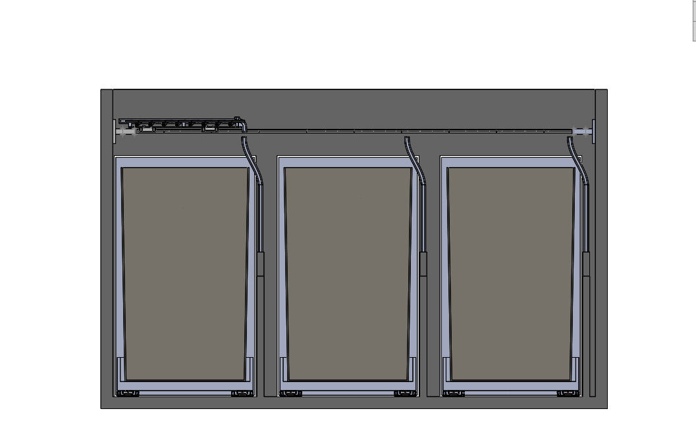
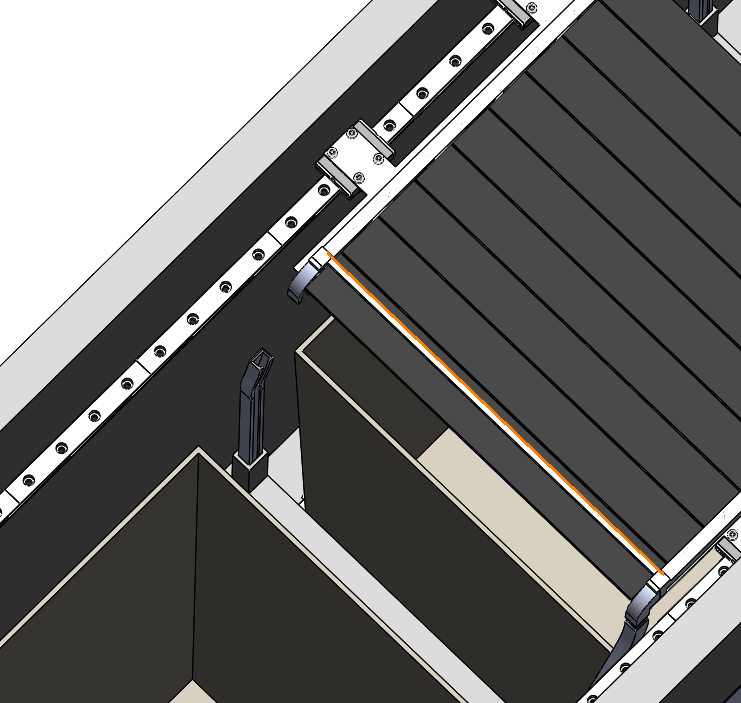
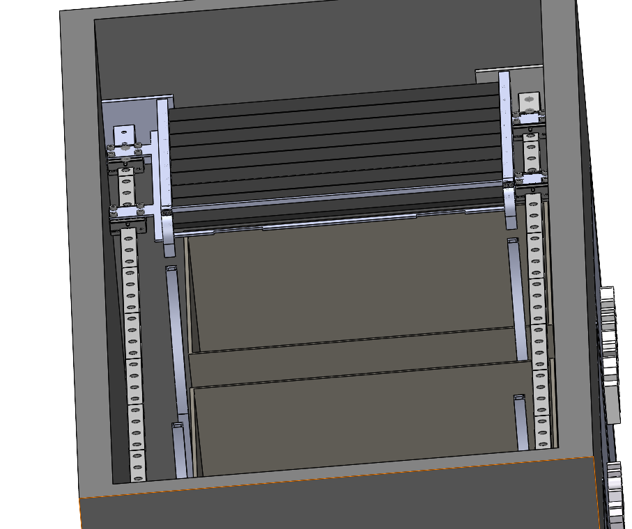
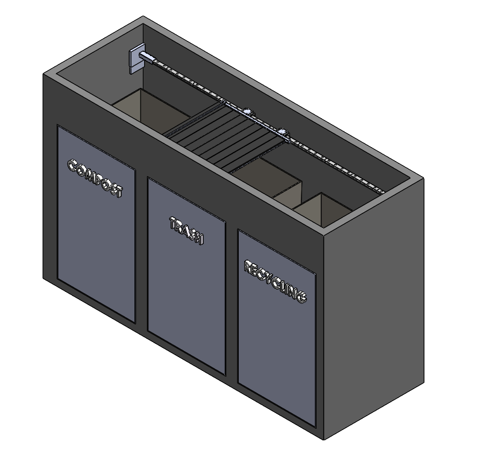
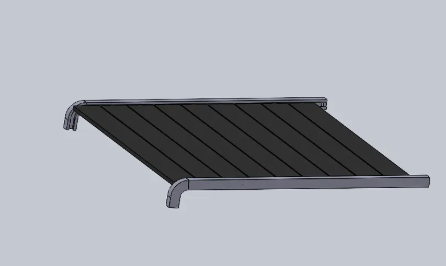
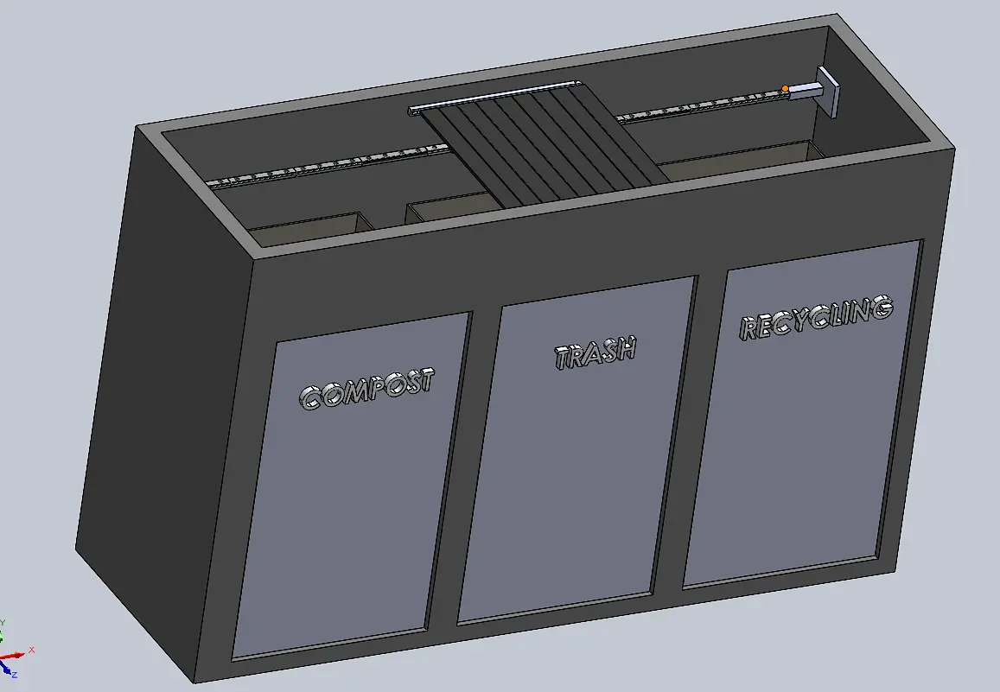
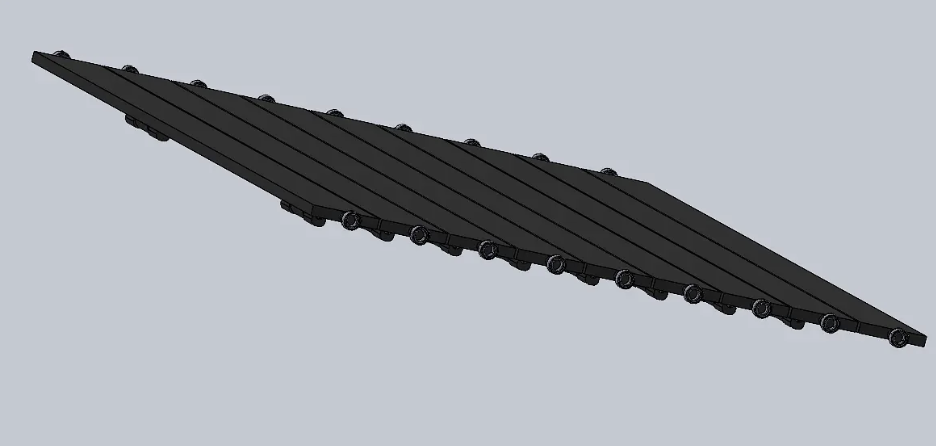
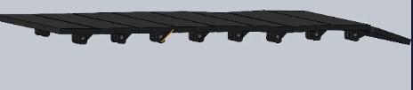
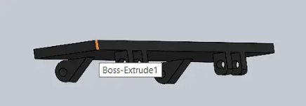
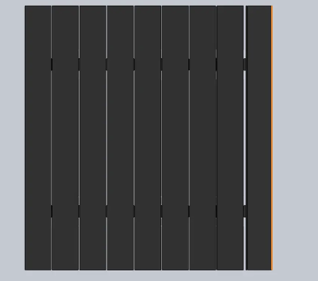

# Journal
# 7/13/26 - Dividers With Curved Guide Rails
Today I finished the dividers with holders on them to hold the guide rails. The reason I have guide rails in the dividers is because it allows form the platform links to slide into them and slide out easily. This movement allows the links to open or close the platform. 

# 7/11/26 - Updated Sliders(Platform Movers)
Today I worked on adding two carriages on each linear rail slider, so the platform would be more rigid instead of one on each slider. This time around I also was able to make the carriages move the platform instead of being stuck in place. This really helped me realize how the final output of EcoSort would look like. My next task is to add dividers in between each trash can so I can get the platform links to move into the divider guide rails.

# 7/9/26 - Platform Guides and Bearing Holders(5hr 44m)
Today I have got most of the platform that will hold the item done. I finished the guiderails that let the panel links move smoothly. Next I have to mount the platform on linear rails to allow the platform to move over a certain bin.

# 7/8/26 - Platform Links(47m)
I’ve added bearings to my platform this will allow the platform to move in these guide rails I will design later.

# 7/8/26 - Platform Links(2h 22m)
Today I was working on the platform that holds the item. I was able to finish this part assembly. Next I need a frame to use to hold the platform and allowing it to move and drop the item. Overall today I got a lot accomplished. Here are some of the photos down below.

## 7/7/26 - Linear Rails for Platform(5hrs)
### Linear Rails
This one took a while because I had to look for affordable linear rails that also had cad files to use. I ended up deciding on the MGN12c Ender 3 Linear guide rail kit 1000mm a rail + slider. The issue with this product though was that they only had the cad file for one small rail not a 1000mm rail. I ended up using another person's cad in addition to the offical cad file from the ender linear guide. This worked pretty well becuase I was able to take the rails from the other person's model and just add on to the official cad from ender to make it the 1000mm length I needed. 
### Colors and Appearance
I also changed the color of the frame of EcoSort and added a label on each bin front, so people can distinguish what bin is what. 

## 7/6/26 - Drawer Holes Alignment with Drawer Bins(3hrs)
I have aligned the drawers holes for each bin to the coressponding drawer bin. I have added a front panel to the front of the drawer bin holder.

## 7/2/26 - Bin Drawers(5hrs)
This took longer than I wanted to because I had to deside how I would mount the sliders for the drawer, and what sliders I would use that also has a CAD file. I ended up mounting the sliders on the bottom floor of the frame to keep the width as compact as possible while having 3 bins. I also had to create a bin holder that would be mounted to the sliders. I had to adjust it though by making holes where the mounting holes are for the sliders. Work still needs to be done for the holes for the drawer bins to come out of the frame because at the moment it is off centered. 

## 7/1/26 - EcoSort Finalization of Exterior and Bins(3hrs)
This was the start of the CAD work, so I had to spend more time on descisions regarding size, shape, and thickness on the exterior frame and bins. 